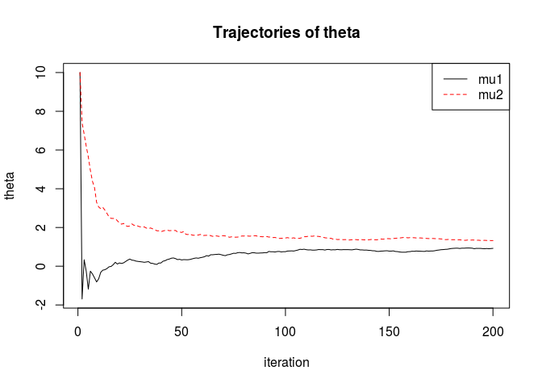
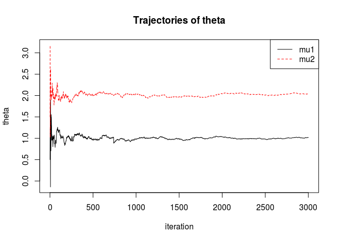

<!-- README.md is generated from README.Rmd. Please edit that file -->
ApproxML
========

ApproxML implements an algorithm that approximates the maximum likelihood estimator in probabilistic models with infeasible likelihood function. It is based on stochastic gradient methods. In each iteration, an ascent direction is obtained using an estimate of the likelihood based on simulations.

The algorithm is described in detail in (Bertl et al. 2017).

To make the approximate maximum likelihood algorithm flexibly applicable to a range of problems that can be tackled via simulations, users can write their own simulation functions that are easily passed to the algorithm. A small set of simulation functions is already included.

The algorithm is implemented in a "pure" R version and a version that uses Rcpp. On the long run, the slower pure R version might be replaced by the Rcpp version, or the two versions will be joined to a more flexible function. For now, the pure R version is kept to make it easy for users without C++ or Rcpp knowledge to add new models. The pure R version can also be used if Rcpp/C++ compilation fails. In addition, the two versions can be used for testing, speed and memory profiling and debugging.

Installation
------------

ApproxML is available on [github](https://github.com/johannabertl/ApproxML).

Using the R package [devtools](https://cran.r-project.org/web/packages/devtools/index.html), it can directly be downloaded from github and installed from within R:

``` r
library("devtools")
install_git("https://github.com/johannabertl/ApproxML")
```

Alternatively, clone or download the package manually from [github](https://github.com/johannabertl/ApproxML) and save it in directory this/is/my/directory. Then install the package in R:

``` r
install.packages("this/is/my/directory/ApproxML", repos = NULL)
```

Note that the fast version in the branch Rcpp uses C++ code via the interface Rcpp (Edelbuettel and François 2011). To install this, a C++ compiler is required. Details about Rcpp can be found at [www.rcpp.org](http://www.rcpp.org/) and [CRAN](https://cran.r-project.org/web/packages/Rcpp/index.html).

R implementation (master branch)
--------------------------------

Three versions of the approximate maximum likelihood algorithm are implemented: KDKW.FD (finite differences), KDKW.FD.CRN (finite differences with common random numbers) and KDKW.SP (simultaneous perturbations). The finite differences and simultaneous perturbations versions are described in detail (Bertl et al. 2017) and the corresponding help pages.

### Usage example

Problem: Estimating the mean vector of a bivariate normal distribution with summary statistics mean1+mean2 and mean1\*mean2 while the diagonal VC matrix is known (using the default with var1 = var2 = 1):

``` r
library(ApproxML)

set.seed(1234)
test1 = KDKW.FD(s.obs=c(2,0), theta.0=c(10,10), simfun=SIMnormal.mult2a, 
                rest=matrix(c(-100, 100), ncol=2, nrow=2, byrow=T), 
                ce=1, gamma = 1/6, C=0, a = 10, alpha = 1, A=0, 
                K=200, nk=20, Hfun = bw.nrd0.flex, Hnum="once",
                kernel=robust.unscaled.diagonal, lg = T, n=1)
```

Plotting the trajectories:

``` r
matplot(test1$theta, type="l", xlab = "iteration", ylab = "theta", main =  "Trajectories of theta")
legend("topright", col=c(1,2), lty=1:2, legend=c("mu1", "mu2"))
```



### Implementation of new simulation functions

A handful of simulation functions are provided (their names start with `SIM*`). The simulation function is passed to KDKW.FD and the other algorithms via the argument `simfun`. Additional arguments for the simulation are passed via the "..." argument in the KDKD.FD function. In the simulation function, these are named arguments. The simulation function also computes the summary statistics.

Requirements for new simulation functions:

-   Input parameters: `nk`, `theta`, additional arguments or parameters for the simulation that are not estimated.
-   Functionality: Simulation of `nk` datasets with parameters `theta` and the additional arguments, computation of summary statistics for each dataset.
-   Output: Matrix with `nk` lines, where each line contains the summary statistics vector of one simulated dataset. If the summary statistics vector is of dimension 1, a matrix of dimension nk times 1 needs to be output.

Example: Bivariate normal distribution. Estimation of the mean vector with given diagonal VC matrix and given sample size.

``` r
SIMnormal.mult2a = function(nk, mu, sigma = c(1,1), n){
    
    x1 = matrix(rnorm(nk*n, mu[1], sqrt(sigma[1])), ncol = nk, nrow = n)
    x2 = matrix(rnorm(nk*n, mu[2], sqrt(sigma[2])), ncol = nk, nrow = n)
    
    mean1 = apply(x1, 2, mean)
    mean2 = apply(x2, 2, mean)
    
    sumstat = cbind(mean1+mean2, mean1*mean2)
    sumstat     
}
```

-   Input: `nk`, `mu` -- mean vector (estimated), `sigma` -- diagonal of the VC matrix (not estimated), `n` -- sample size (not estimated)
-   Output: nk times 2 matrix with the summary statistics mean1 + mean2 and mean1\*mean2

(This is an artificial example. The summary statistics are not optimal.)

In each iteration, the simulation function is called 2p times, with p the dimension of the paremeter vector theta (FD algorithms), or 2 times (SP algorithms). Consequently, the computation time of the algorithm depends also on the simulation function.

Rcpp implementation (branch Rcpp)
---------------------------------

A faster version of the algorithm is implemented using Rcpp and RcppArmadillo. The R function KDKW\_FD\_Rcpp contains approximately equivalent functionality as KDKW.FD.

A few simulation functions are included, but unlike KDKW.FD, where the simulation function is an R function, in KDKW\_FD\_Rcpp, the simulation function is implemented in Rcpp.

### Usage example

Problem: Estimating the mean vector of a bivariate normal distribution with the arithmetic means as summary statistics while the VC matrix is known (here diagonal with var1 = var2 = 1):

``` r
test_Rcpp = KDKW_FD_Rcpp(s_obs = c(1,2), theta_0 = c(0.5,1.5), theta_min = c(-5, -5), 
theta_max = c(5, 5), K = 3000, a = 10, ce = 2, nk = 10, simfun = "Normal",
fixed_parameters = list(VC = diag(2))) 
```

Plot trajectories:

``` r
matplot(test_Rcpp$theta, t="l", xlab = "iteration", ylab = "theta", main =  "Trajectories of theta")
legend("topright", col=c(1,2), lty=1:2, legend=c("mu1", "mu2"))
```



### Implementation of simulation functions

The ApproxML algorithm can be extended to estimate parameters of a new probabilistic model by implementing a new simulation function in Rcpp. Probabilistic models and correspoding simulation functions are implemented using C++ classes.

The basic class `Model` is implemented in the file `Model.h`. It consists of a numeric vector parameters (the parameters to be estimated by the AML algorithm) and an optional list of fixed parameters. It contains two generic methods, Create\_Model and simulate:

``` rcpp
class Model {
public:
  arma::vec parameters;
  List fixed_parameters;
  static Model* Create_Model(String type);
  virtual arma::mat simulate(int nk) = 0;
};
```

A particular model, from which simulations and summary statistics are to be obtained, is a child class of `Model` and needs to be implemented in a separate header file. As an example, I will present the class `Normal` that is used to estimate the mean vector of a multivariate normal distribution with a fixed variance covariance matrix. It is implemented in the header file `Normal.h`.

``` rcpp
class Normal: public Model{
public:
  arma::mat simulate(int nk) {
    arma::mat VC = as<arma::mat>(Model::fixed_parameters["VC"]);
    return mvnrnd(Model::parameters, VC, nk).t();
  }
};
```

The method `simulate` simulates data under the model `Normal` and computes summary statistics. Note that the function accesses both the parameters that are estimated (`Model::parameters`) as well as the fixed parameters, which in this case only have one entry, the VC matrix (`Model::fixed_parameters["VC"]`).

The class `Model_Factory`, implemented in the header file `Model_Factory.h`, has a method to create a Model of a given type, e. g. `"Normal"`.

``` rcpp
class Model_Factory {
public:
  Model* Create_Model(String type) {
    if ( type == "Normal" ) return new Normal();
    if ( type == "Coalescent_theta" ) return new Coalescent_theta();
    return NULL;
  }
};
```

When a new model is implemented, a new entry in the method `Create_Model` is required.

References
==========

Bertl, J., G. Ewing, C. Kosiol, and A. Futschik. 2017. “Approximate Maximum Likelihood Estimation for Population Genetic Inference.” *Statistical Applications in Genetics and Molecular Biology* 16 (5-6): 291–312.

Edelbuettel, Dirk, and Romain François. 2011. “Rcpp: Seamless R and C++ Integration.” *Journal of Statistical Software* 40 (8).
